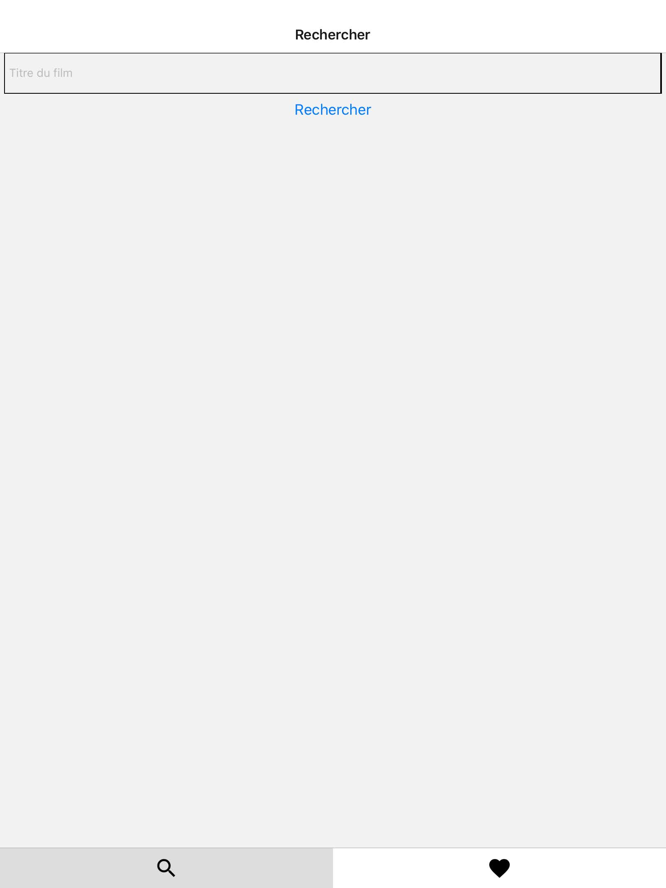
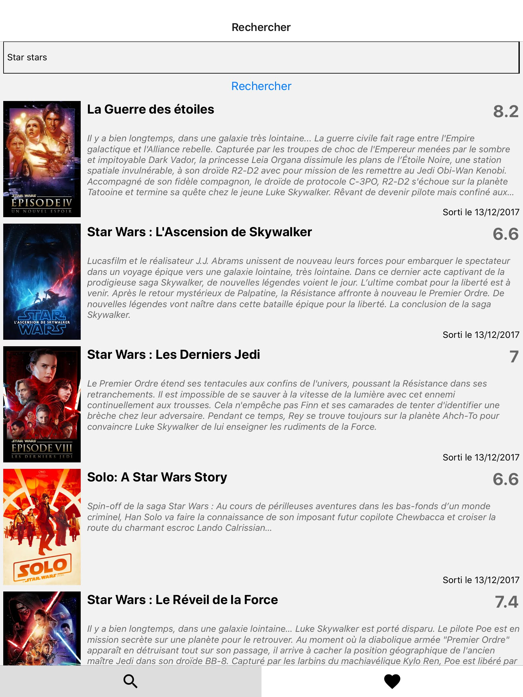
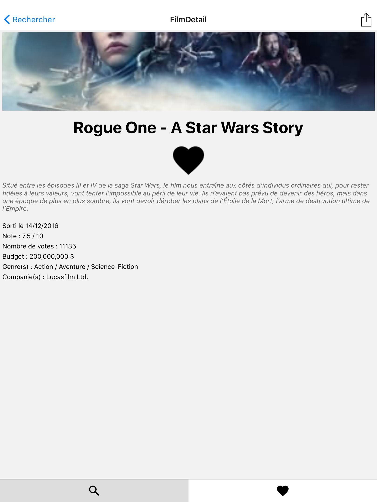
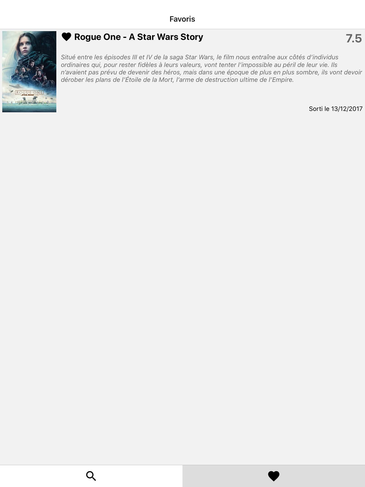

# Movies And Me

I did it during my 3rd year of university license. This is a personnal project, and is developed in Python3. This project is finished.

I specify that I made this project while following in training on React Native in autoditact.

## How work

You can search movies, add them in a favorites list of movies, share them and hir summary to yours friends.

Whith the search, you can find any movie and his informations like year, budget, summary, etc.

## Prerequisite

You need to have React Native and his modules to use thus projet, and to download `expo` app on your device.

## To begin

Do the command : `$ git clone https://github.com/debroucker/movieAndMe.git` to recover this repository.

## Start-up
To launch the project, do the command : `$ npm start` , and scan the QRcode in the expo app.

### home screen :

### search movie  :

### the selected movie :

### your favorites movies list :

## Made with

Visual Studio Code

## Authors

DEBROUCKER Tommy
